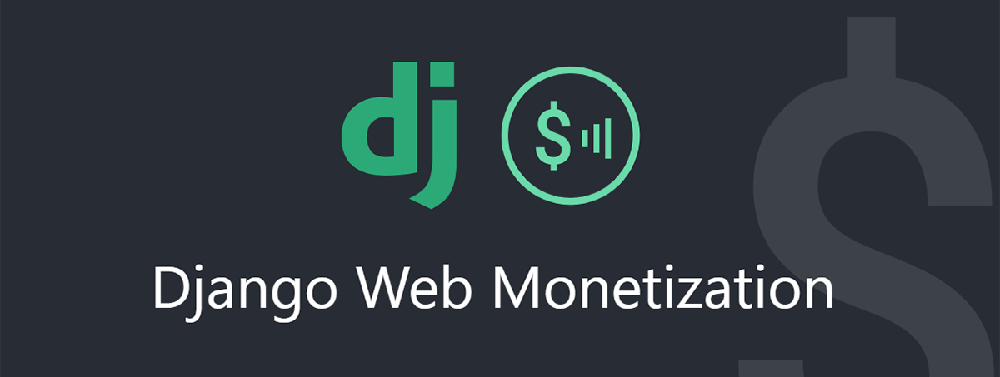

# django-web-monetization
A simple integration for the Web Monetization API.



## About

[Django Web Monetization](https://github.com/LloydTao/django-web-monetization) is a simple way to integrate web monetization with your Django project.

The package can be found at PyPI ([django-web-monetization](https://pypi.org/project/django-web-monetization/)).

## Web Monetization

This new technology is currently being proposed as a W3C standard. 

"*The web suffers from a flood of advertising and corrupt business models. Web Monetization provides an open, native, efficient, and automatic way to compensate creators, pay for API calls, and support crucial web infrastructure.*"

You can read more at the official [Web Monetization](https://webmonetization.org/) website.

## Usage

To use the app, install the package through `pip`:

```bash
$ pip install django-web-monetization
```

Make sure to add "monetization" to your INSTALLED_APPS, like this:

```python
# settings.py

    INSTALLED_APPS = [
        ...
        "monetization",
    ]
```

## Contributing

Official contribution guideline documents will be added soon.

## License

This code is available under the [MIT License](https://github.com/LloydTao/django-web-monetization/blob/master/LICENSE).
